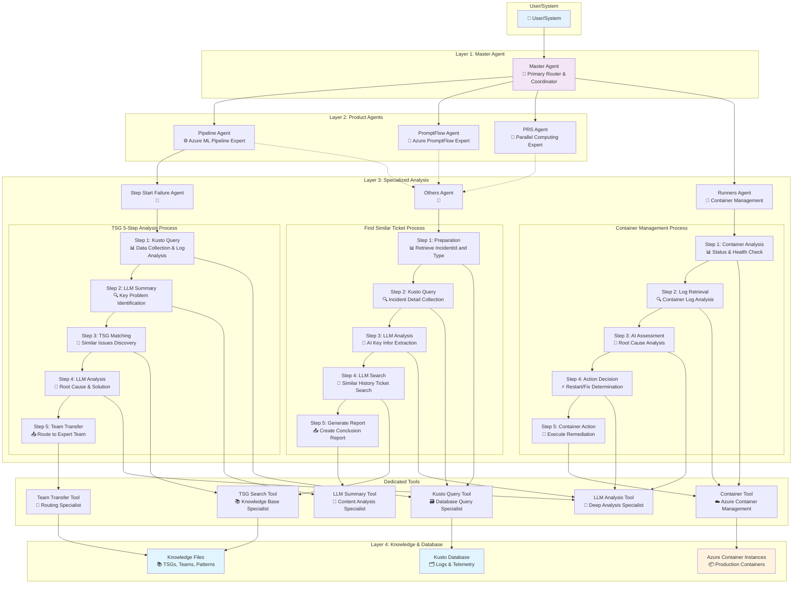
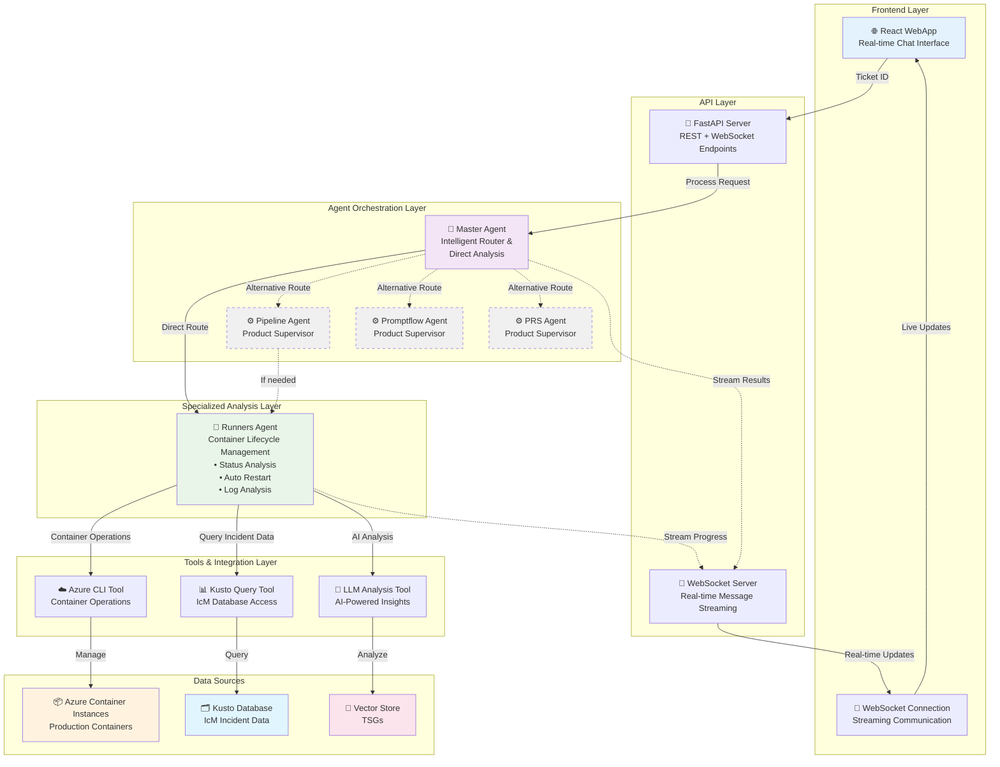

# IcM Multi-Agent System with LangGraph

An intelligent incident management system that routes tickets to specialized agents based on content analysis, team information, and ticket categories.

## 🎯 Background

In the current incident management workflow, DRIs (Directly Responsible Individuals) face significant challenges:

- **Time-Intensive Investigation**: DRIs must invest substantial time researching and analyzing each ticket to understand the root cause and determine appropriate actions
- **Cross-Team Ticket Misrouting**: A large portion of tickets don't actually belong to our team, requiring additional time to identify the correct ownership and transfer appropriately
- **Manual Triage Process**: Without early analysis, DRIs often dive deep into investigation before realizing the ticket should be handled by another team
- **Efficiency Bottlenecks**: The manual process of ticket analysis, categorization, and routing creates significant delays in incident resolution

## 💡 Solution

This AI-powered multi-agent system addresses these challenges by:

- **Pre-Investigation Analysis**: Automatically analyzes tickets using AI before DRIs begin deep investigation, providing immediate insights into likely root causes and team ownership
- **Intelligent Team Routing**: Uses IcM database integration and team ownership information to automatically route tickets to the correct teams, reducing misrouted tickets
- **Historical Pattern Matching**: Leverages past incident data to identify similar issues and their resolutions, providing DRIs with relevant historical context
- **Automated Triage**: Performs initial categorization and analysis, allowing DRIs to focus their time on actual investigation and resolution rather than basic triage

**Result**: Significantly improved DRI efficiency by reducing time spent on initial analysis, eliminating investigation of misrouted tickets, and providing AI-generated insights to accelerate problem resolution.

## 🏗️ System Architecture

### v1 CLI Architecture (Legacy Reference)




### v2 WebApp Architecture (Current Implementation)



### Key Features of v2 Architecture

#### **🌐 Real-time Web Interface**
- **React Frontend**: Modern, responsive chat interface
- **WebSocket Streaming**: Live progress updates during analysis
- **Message Merging**: Smart consolidation of progress messages
- **Auto-refresh**: Real-time status updates without page reload

#### **🤖 Direct Agent Routing**
- **Master Agent**: Direct routing to Runners Agent for container issues
- **Simplified Flow**: Master → Runners Agent (primary path)
- **Pipeline Agent**: Available as alternative supervisor but not in main flow
- **Automatic Operations**: No user confirmation required for actions

#### **⚙️ Container Management Capabilities**
- **Status Analysis**: AI-powered container health assessment
- **Auto-restart**: Intelligent container restart without manual approval
- **Log Analysis**: Comprehensive container log examination
- **Multi-region Support**: Handles containers across all Azure regions

#### **📡 Streaming Architecture**
- **Real-time Communication**: WebSocket-based bidirectional streaming
- **Progress Tracking**: Live updates during long-running operations
- **Error Handling**: Graceful failure management and user feedback
- **Thread-safe Operations**: Concurrent request handling


### System Components Overview

#### **v2 WebApp Components (Current)**

**Frontend Layer:**
- **React WebApp**: Modern, responsive chat interface with real-time updates
- **WebSocket Client**: Bidirectional streaming communication for live progress tracking

**API Layer:**
- **FastAPI Server**: High-performance async API with REST and WebSocket support
- **WebSocket Server**: Real-time message streaming with thread-safe callback handling

**Agent Orchestration:**
- **Master Agent**: Direct intelligent routing to Runners Agent for container issues
- **Pipeline Agent**: Available as alternative product supervisor (not in main flow)

**Specialized Analysis:**
- **Runners Agent**: Container lifecycle management with:
  - AI-powered status analysis using Azure OpenAI
  - Automatic container restart (no manual confirmation required)  
  - Comprehensive log analysis and pattern recognition
  - Multi-region Azure Container Instance support

**Tools & Integration:**
- **Azure CLI Tool**: Direct Azure Container Instance management
- **Kusto Query Tool**: IcM database integration for incident data
- **LLM Analysis Tool**: AI-powered root cause analysis and recommendations

#### **v1 CLI Components (Legacy Reference)**

**Layer 1: Master Agent - Intelligent Router**
- **Routing strategy** with fallback mechanisms:
  1. **Team-based routing** (highest priority): Uses IcM owning team information
  2. **Text analysis routing** (fallback): Content-based analysis using LLM

**Layer 2: Product Team Supervisors**
- **Pipeline Supervisor**: Routes issues related to Pipeline, AEther, Designer.
  - Routes to specialized agents based on Kusto category queries
  - Supports Step Start Failure Agent, Runners Agent, and Others Agent
- **PromptFlow Supervisor**: Routes issues related to Promptflow Service, especially control plane.
  - Currently routes all incidents to Others Agent for similarity analysis
- **PRS Supervisor**: Routes issues related to Parallel Computing.
  - Currently routes all incidents to Others Agent for similarity analysis

**Layer 3: Specialized Analysis Agents**
- **Specialized Agent**: TSG-like analysis following a routine
   - **Example: Step Start Failure Agent: Specialized for step start failure incidents**
      - Performs comprehensive root cause analysis using LLM
      - Matches against built-in TSG (Technical Support Guide) rules
      - Provides structured recommendations and transfer guidance
      - **5-Step Process**:
         1. Extract incident details via Kusto queries
         2. LLM-powered root cause analysis 
         3. TSG rule pattern matching
         4. Generate comprehensive analysis report
         5. Provide transfer recommendations

- **Runners Agent**: Specialized container lifecycle management agent
  - Container status analysis and health assessment
  - AI-powered log analysis and anomaly detection
  - Container restart decision making and execution
  - Multi-region Azure Container Instance support
  - **5-Step Container Process**:
    1. Container analysis via Azure CLI
    2. Log retrieval and examination
    3. AI assessment of root cause
    4. Action decision (restart/fix determination)
    5. Container action execution

- **Others Agent**: Handles incidents that don't match specific categories
  - Analyzes ticket content to extract problem stage, key logs, and conclusions
  - Searches for similar historical tickets using AI-powered similarity matching
  - Provides insights based on past incident resolutions and patterns
  - **5-Step Process**:
    1. Retrieve incident ID and determine product type
    2. Query incident details from Kusto database
    3. AI analysis to extract key information
    4. Search historical tickets for similar patterns
    5. Generate similarity report with recommendations

### Core Tools

#### **v2 WebApp Tools**

- **Azure CLI Tool**: Direct Azure Container Instance management
  - Container status checking and health assessment
  - Automatic container restart operations
  - Log retrieval and analysis
  - Multi-region support across all Azure regions
  - Resource group and subscription management

- **Kusto Query Tool**: IcM database integration for real-time incident data
  - Incident details extraction and processing
  - Container-related incident categorization
  - Historical data analysis and pattern recognition
  - HTML content cleaning and structured data parsing

- **LLM Analysis Tool**: AI-powered analysis using Azure OpenAI
  - Container status interpretation and decision making
  - Log analysis and anomaly detection
  - Root cause analysis and recommendation generation
  - Natural language summarization of technical findings

#### **v1 CLI Tools (Legacy)**

- **Kusto Query Tool**: IcM database integration for real-time incident data
  - Incident details extraction
  - Owning team information
  - Category and classification data
  - HTML content cleaning and processing

- **Container Tool**: Azure Container Instance management (used by Runners Agent)
  - Container status checking and health monitoring
  - Container restart and lifecycle operations
  - Log retrieval and analysis capabilities
  - Multi-region Azure resource management
  - Integration with Azure CLI for container operations

- **Find Similar Tickets Tool**: AI-powered historical ticket matching
  - Excel-based historical data processing
  - LLM-driven similarity analysis
  - Product-specific filtering (Pipeline, PromptFlow, PRS)
  - Confidence scoring and ranking

- **Team Transfer Tool**: Automated ticket routing
  - IcM team identification and validation
  - Automated ticket transfer recommendations
  - Team ownership verification

- **TSG Search Tool**: Knowledge base pattern matching
  - Technical Support Guide rule matching
  - Historical troubleshooting pattern recognition
  - Solution recommendation generation

### Key Features

#### **v2 WebApp Features (Current)**
- **Real-time Web Interface**: Modern React-based chat interface with live updates
- **WebSocket Streaming**: Bidirectional real-time communication during analysis
- **Simplified Agent Architecture**: Streamlined Master → Pipeline → Runners flow
- **Automatic Container Management**: AI-powered container restart without manual confirmation
- **Container Lifecycle Expertise**: Specialized analysis and management of Azure Container Instances
- **Multi-region Support**: Handles containers across all Azure regions globally
- **Smart Message Merging**: Consolidates progress updates for cleaner user experience
- **Thread-safe Operations**: Concurrent request handling with proper async/await patterns
- **Structured Streaming Output**: Real-time progress tracking with typed message formats

#### **v1 CLI Features (Legacy)**
- **Hierarchical Multi-Agent Architecture**: Three-layer system with clear responsibilities
- **IcM Database Integration**: Real-time ticket data via Kusto queries
- **Team-based Intelligent Routing**: Automatic routing based on owning team detection
- **Specialized Analysis**: Dedicated agents for specific incident types
- **TSG Rule Matching**: Automated troubleshooting guide application
- **Historical Similarity Matching**: AI-powered similar ticket discovery
- **Fallback Mechanisms**: Graceful degradation when services unavailable
- **Structured Output**: Pydantic models for consistent data handling

## 🚀 Getting Started

### Prerequisites

1. **LLM Access**
   - Azure OpenAI endpoint and API key
   - GPT-4 or GPT-3.5-turbo deployment

2. **Azure Authentication**
   ```cmd
   az login
   ```

3. **Network Access**
   - VPN connection to access IcM Kusto cluster
   - Connectivity to `icmcluster.kusto.windows.net`

4. **Development Environment** (for v2 WebApp)
   - Node.js and npm for frontend development
   - Python 3.8+ for backend services

5. **Historical Data** (for v1 CLI Others Agent)
   - Place `past_tickets_with_ai_summary.xlsx` in `data/` directory

### Installation

#### **v2 WebApp Setup (Recommended)**

1. **Clone the repository**
   ```cmd
   git clone <repository-url>
   cd IcM-multi-agent/v2-webapp
   ```

2. **Backend Setup**
   ```cmd
   pip install -r requirements.txt
   copy .env.template .env
   # Edit .env file with your Azure OpenAI credentials
   ```

3. **Frontend Setup**
   ```cmd
   cd frontend
   npm install
   npm run build
   cd ..
   ```

4. **Run the Application**
   ```cmd
   python main.py
   ```
   Then open http://localhost:8000 in your browser.

#### **v1 CLI Setup (Legacy)**

1. **Clone the repository**
   ```cmd
   git clone <repository-url>
   cd IcM-multi-agent/v1-cli
   ```

2. **Install dependencies**
   ```cmd
   pip install -r requirements.txt
   ```

3. **Configure environment**
   ```cmd
   copy .env.template .env
   # Edit .env file with your Azure OpenAI credentials
   ```

### Configuration

Create a `.env` file with the following variables:

```env
# Azure OpenAI Configuration
AZURE_OPENAI_ENDPOINT=https://your-resource.openai.azure.com/
AZURE_OPENAI_API_KEY=your-api-key-here
AZURE_OPENAI_API_VERSION=2024-02-15-preview
AZURE_OPENAI_DEPLOYMENT_NAME=gpt-4

# Optional: Kusto Configuration (uses DefaultAzureCredential)
# KUSTO_CLUSTER_URL=https://icmcluster.kusto.windows.net
# KUSTO_DATABASE=IcMDataWarehouse
```

## 🔧 Usage

### v2 WebApp Usage (Recommended)

1. **Start the Application**
   ```cmd
   cd v2-webapp
   python main.py
   ```

2. **Access the Web Interface**
   - Open http://localhost:8000 in your browser
   - You'll see a modern chat interface

3. **Process an Incident**
   - Enter an incident ID (e.g., `631600195`) in the input field
   - Click "Process Ticket" or press Enter
   - Watch real-time progress updates as agents analyze the incident

4. **Features Available**
   - **Real-time streaming**: See live progress updates during analysis
   - **Auto-restart containers**: Containers are automatically restarted when needed
   - **Container management**: View status, logs, and restart operations
   - **Comprehensive reports**: Get detailed analysis and recommendations

### v1 CLI Usage (Legacy)

1. **Basic CLI Usage**
   ```cmd
   cd v1-cli
   python main.py
   ```

2. **Enter Incident ID**
   ```
   📝 Please enter an incident ID (or 'quit' to exit):
   > 631600195
   ```

### System Workflow

#### **v2 WebApp Workflow**
1. **Web Interface**: User enters incident ID in chat interface
2. **Direct Routing**: Master Agent analyzes and routes directly to Runners Agent
3. **Container Analysis**: Runners Agent performs comprehensive container analysis
4. **Automatic Actions**: Containers are restarted automatically when needed
5. **Live Updates**: Users see progress via WebSocket streaming
6. **Final Report**: Comprehensive analysis with actions taken

Note: Pipeline Agent is available as an alternative supervisor but not in the main flow.

#### **v1 CLI Workflow**
1. **Input Processing**: Extract incident ID from user input
2. **Master Agent Routing**: Determine product team based on owning team information
3. **Team Supervisor Processing**: Route to appropriate specialized agent
4. **Specialized Analysis**: Comprehensive analysis by dedicated agents
5. **Results**: Detailed reports with recommendations and insights

### Example Outputs

#### v2 WebApp Container Analysis
```
🔄 Runners Agent Analysis Report
=================================

📋 Incident Information:
- Incident ID: 631600195
- Container: pipeline-runner-abc123
- Resource Group: runners-westus2
- Status: Terminated → Restarted Successfully

🔧 Actions Taken:
- ✅ Container status analyzed via AI
- ✅ Automatic restart performed
- ✅ Post-restart verification completed
- ✅ Logs analyzed for patterns

📊 Analysis Results:
- Root Cause: Container memory exhaustion
- Confidence: 98.5%
- Resolution: Container restart successful
```

#### v1 CLI Step Start Failure Analysis
```
🎫 STEP START FAILURE ANALYSIS REPORT
================================================

📋 **Incident Information:**
- Incident ID: 631600195
- Title: [ModelFun] - The scope module in AML cannot be started
- Severity: 3

🔍 **Root Cause Analysis:**
- **Failed Step:** Submit APCloud Job
- **Immediate Cause:** The SSL connection could not be established
- **Step Cause:** Retriable exception occurred while running job
- **Confidence:** 100.0%

⚡ **TSG Rule Match:**
- **Matched Rule:** APCloud submission failure requiring Aether team intervention
- **Match Confidence:** 90.0%

🎯 **Recommended Action:**
- **Action:** Transfer to Aether team
- **Transfer To:** AEther/AEther
```

#### Similar Tickets Analysis
```
🎫 **GENERAL INCIDENT ANALYSIS REPORT**
================================================

📋 **Incident Information:**
- Incident ID: 631600195
- Title: [ModelFun] - The scope module in AML cannot be started
- Summary: The scope module in AML cannot be started, retried multiple times with the same error...

🔍 **SIMILAR HISTORICAL TICKETS FOUND:**
Found 3 similar tickets that can provide insights:

**1. Incident ID: 631600195** (Similarity: 95.0%)
   **Title:** [ModelFun] - The scope module in AML cannot be started
   **Reason:** Exact match in Title, AI_ProblemStage (runtime), AI_KeyLog (SSL connection issue due to invalid certificate), and AI_Conclusion (invalid SSL certificate causing connection failure).
   **AI Conclusion:** The issue was caused by an invalid SSL certificate, which prevented the establishment of a secure connection for the job submission.
   **Human Investigation:** Transferred to AEther/AEther.

**2. Incident ID: 631763151** (Similarity: 90.0%)
   **Title:** AML Scope Job cannot submit
   **Reason:** Strong match in AI_ProblemStage (runtime), AI_KeyLog (SSL connection issue due to invalid certificate), and AI_Conclusion (invalid SSL certificate causing connection failure). Title is closely related to the current incident.
   **AI Conclusion:** The issue is related to SSL connection problems due to an invalid remote certificate, which is causing jobs to remain in a 'not started' status.
   **Human Investigation:** Transferred to AEther/AEther

**3. Incident ID: 631611082** (Similarity: 85.0%)
   **Title:** All AML job blocked at "Not Started" scope node
   **Reason:** High similarity in AI_ProblemStage (runtime), AI_KeyLog (SSL connection issue due to invalid certificate), and AI_Conclusion (invalid SSL certificate causing connection failure). Title indicates a related issue with job execution.
   **AI Conclusion:** The job is blocked due to an SSL connection issue caused by an invalid remote certificate, specifically due to the certificate being 'NotTimeValid'.
   **Human Investigation:** The status already back to normal
```

## 🧪 Development

### Project Structure

```
IcM-multi-agent/
├── main.py                         # System orchestration and main entry point
├── master_agent.py                 # Smart routing logic with team-based routing
├── product_agents/                 # Product team supervisor agents
│   ├── __init__.py
│   ├── pipeline_agent.py          # Pipeline team supervisor and routing
│   ├── promptflow_agent.py        # PromptFlow team supervisor  
│   └── prs_agent.py               # PRS team supervisor
├── specialized_agents/             # Specialized analysis agents
│   ├── __init__.py
│   ├── step_start_failure_agent.py # TSG-based step failure analysis
│   └── others_agent.py            # Historical similarity matching
├── tools/                          # Core utility tools
│   ├── __init__.py                 # Tool package initialization
│   ├── kusto_query_tool.py        # IcM database integration
│   └── find_similar_tickets_tool.py # AI-powered similarity search
├── data/                           # Data directory
│   └── past_tickets_with_ai_summary.xlsx # Historical ticket data
├── requirements.txt                # Python dependencies
├── .env.template                   # Environment configuration template
└── README.md                       # This documentation
```

### Adding New Specialized Agents

Follow these steps to add a new specialized agent for handling specific incident types:

#### 1. **Create Agent File**
Create a new file in `specialized_agents/` directory:

```python
# specialized_agents/deployment_failure_agent.py
import os
from typing import Literal
from dotenv import load_dotenv
from langchain_openai import AzureChatOpenAI
from langgraph.types import Command
from langgraph.graph import END
from langchain_core.messages import HumanMessage, AIMessage
from langgraph.graph import MessagesState

# Import tools
from tools.kusto_query_tool import kusto_tool

# Load environment variables and initialize model
load_dotenv()
model = AzureChatOpenAI(
    azure_endpoint=os.getenv("AZURE_OPENAI_ENDPOINT"),
    api_key=os.getenv("AZURE_OPENAI_API_KEY"),
    api_version=os.getenv("AZURE_OPENAI_API_VERSION"),
    azure_deployment=os.getenv("AZURE_OPENAI_DEPLOYMENT_NAME")
)

def deployment_failure_agent(state: MessagesState) -> Command[Literal[END]]:
    """
    Specialized agent for analyzing deployment failure incidents
    
    Args:
        state: Current conversation state containing messages
        
    Returns:
        Command: Results and routing instruction to END
    """
    print("🚀 Deployment Failure Agent: Starting analysis...")
    
    # 1. Extract incident ID from messages
    incident_id = extract_incident_id_from_messages(state["messages"])
    if not incident_id:
        error_msg = "❌ Deployment Failure Agent: Could not extract incident ID"
        return Command(goto=END, update={"messages": [AIMessage(content=error_msg)]})
    
    # 2. Query incident details using Kusto tool
    try:
        incident_details = kusto_tool.invoke({"incident_id": incident_id})
        if not incident_details or incident_details.get("error"):
            error_msg = f"❌ Failed to retrieve incident details: {incident_details.get('error', 'Unknown error')}"
            return Command(goto=END, update={"messages": [AIMessage(content=error_msg)]})
    except Exception as e:
        error_msg = f"❌ Error querying incident details: {str(e)}"
        return Command(goto=END, update={"messages": [AIMessage(content=error_msg)]})
    
    # 3. Perform specialized deployment analysis
    analysis_result = analyze_deployment_failure(incident_details)
    
    # 4. Generate comprehensive report
    report = generate_deployment_analysis_report(incident_id, incident_details, analysis_result)
    
    print("✅ Deployment Failure Agent: Analysis complete")
    return Command(goto=END, update={"messages": [AIMessage(content=report)]})

def analyze_deployment_failure(incident_details):
    """Analyze deployment-specific failure patterns"""
    # Implementation details...
    pass

def generate_deployment_analysis_report(incident_id, incident_details, analysis):
    """Generate formatted deployment analysis report"""
    # Implementation details...
    pass

def extract_incident_id_from_messages(messages):
    """Extract incident ID from conversation messages"""
    # Implementation details...
    pass
```

#### 2. **Update Product Team Supervisor**
Add routing logic in the appropriate team supervisor (e.g., `pipeline_agent.py`):

```python
# In product_agents/pipeline_agent.py
def route_to_specialized_agent(state: MessagesState) -> Literal["step_start_failure_agent", "deployment_failure_agent", "others_agent"]:
    """Route to appropriate specialized agent based on incident category"""
    
    # Get incident details and category
    incident_id = extract_incident_id_from_messages(state["messages"])
    incident_details = kusto_tool.invoke({"incident_id": incident_id})
    category = incident_details.get("category", "").lower()
    
    print(f"🏷️ Pipeline Supervisor: Incident category: {category}")
    
    # Route based on category patterns
    if "step start failure" in category or "step failure" in category:
        print("🎯 Pipeline Supervisor: Routing to Step Start Failure Agent")
        return "step_start_failure_agent"
    elif "deployment" in category or "deploy" in category or "build failure" in category:
        print("🎯 Pipeline Supervisor: Routing to Deployment Failure Agent")
        return "deployment_failure_agent"
    else:
        print("🎯 Pipeline Supervisor: Routing to Others Agent for similarity analysis")
        return "others_agent"
```

#### 3. **Register in Team Graph**
Update the team graph creation function:

```python
# In product_agents/pipeline_agent.py
def create_pipeline_team_graph():
    """Create the pipeline team graph with specialized agents"""
    
    # Import the new agent
    from specialized_agents.deployment_failure_agent import deployment_failure_agent
    
    pipeline_builder = StateGraph(MessagesState)
    
    # Add supervisor node
    pipeline_builder.add_node("pipeline_supervisor", pipeline_supervisor)
    
    # Add specialized agent nodes
    pipeline_builder.add_node("step_start_failure_agent", step_start_failure_agent)
    pipeline_builder.add_node("deployment_failure_agent", deployment_failure_agent)  # New agent
    pipeline_builder.add_node("others_agent", others_agent)
    
    # Add routing edges
    pipeline_builder.add_conditional_edges(
        "pipeline_supervisor",
        route_to_specialized_agent,
        {
            "step_start_failure_agent": "step_start_failure_agent",
            "deployment_failure_agent": "deployment_failure_agent",  # New routing
            "others_agent": "others_agent"
        }
    )
    
    # Add end edges
    pipeline_builder.add_edge("step_start_failure_agent", END)
    pipeline_builder.add_edge("deployment_failure_agent", END)  # New end edge
    pipeline_builder.add_edge("others_agent", END)
    
    # Set entry point
    pipeline_builder.add_edge(START, "pipeline_supervisor")
    
    return pipeline_builder.compile()
```

#### 4. **Update Import Statements**
Ensure proper imports in the main system:

```python
# In main.py
from specialized_agents.deployment_failure_agent import deployment_failure_agent
```

### Adding New Product Agents

Follow these steps to add a new product team supervisor:

#### 1. **Create Product Agent File**
Create a new file in `product_agents/` directory:

```python
# product_agents/security_agent.py
import os
from typing import Literal
from dotenv import load_dotenv
from langchain_openai import AzureChatOpenAI
from langgraph.types import Command
from langgraph.graph import StateGraph, MessagesState, START, END
from langchain_core.messages import HumanMessage, AIMessage

# Import specialized agents
from specialized_agents.others_agent import others_agent
from specialized_agents.security_vulnerability_agent import security_vulnerability_agent

# Import tools
from tools.kusto_query_tool import kusto_tool

# Load environment variables and initialize model
load_dotenv()
model = AzureChatOpenAI(
    azure_endpoint=os.getenv("AZURE_OPENAI_ENDPOINT"),
    api_key=os.getenv("AZURE_OPENAI_API_KEY"),
    api_version=os.getenv("AZURE_OPENAI_API_VERSION"),
    azure_deployment=os.getenv("AZURE_OPENAI_DEPLOYMENT_NAME")
)

def security_supervisor(state: MessagesState) -> Command[Literal["security_vulnerability_agent", "others_agent"]]:
    """
    Security team supervisor that routes security-related incidents
    
    Args:
        state: Current conversation state
        
    Returns:
        Command: Routing decision to appropriate specialized agent
    """
    print("🔒 Security Supervisor: Analyzing incident for security team routing...")
    
    # Extract incident details for routing decision
    routing_decision = route_to_specialized_agent(state)
    
    print(f"🎯 Security Supervisor: Routing to {routing_decision}")
    return Command(goto=routing_decision)

def route_to_specialized_agent(state: MessagesState) -> Literal["security_vulnerability_agent", "others_agent"]:
    """Route to appropriate specialized agent based on incident category"""
    
    try:
        # Get incident details
        incident_id = extract_incident_id_from_messages(state["messages"])
        incident_details = kusto_tool.invoke({"incident_id": incident_id})
        category = incident_details.get("category", "").lower()
        title = incident_details.get("title", "").lower()
        
        print(f"🏷️ Security Supervisor: Category: {category}, Title: {title}")
        
        # Route based on security patterns
        security_patterns = [
            "vulnerability", "security", "cve", "exploit", 
            "authentication", "authorization", "ssl", "certificate",
            "encryption", "breach", "malware", "suspicious"
        ]
        
        if any(pattern in category or pattern in title for pattern in security_patterns):
            print("🎯 Security Supervisor: Routing to Security Vulnerability Agent")
            return "security_vulnerability_agent"
        else:
            print("🎯 Security Supervisor: Routing to Others Agent for general analysis")
            return "others_agent"
            
    except Exception as e:
        print(f"⚠️ Security Supervisor: Error in routing decision: {e}")
        return "others_agent"

def create_security_team_graph():
    """Create the security team graph with specialized agents"""
    
    security_builder = StateGraph(MessagesState)
    
    # Add supervisor node
    security_builder.add_node("security_supervisor", security_supervisor)
    
    # Add specialized agent nodes
    security_builder.add_node("security_vulnerability_agent", security_vulnerability_agent)
    security_builder.add_node("others_agent", others_agent)
    
    # Add routing edges
    security_builder.add_conditional_edges(
        "security_supervisor",
        route_to_specialized_agent,
        {
            "security_vulnerability_agent": "security_vulnerability_agent",
            "others_agent": "others_agent"
        }
    )
    
    # Add end edges
    security_builder.add_edge("security_vulnerability_agent", END)
    security_builder.add_edge("others_agent", END)
    
    # Set entry point
    security_builder.add_edge(START, "security_supervisor")
    
    return security_builder.compile()

# Create the team graph
security_team_graph = create_security_team_graph()

def extract_incident_id_from_messages(messages):
    """Extract incident ID from conversation messages"""
    # Implementation details...
    pass
```

#### 2. **Update Master Agent Routing**
Add the new product team to master agent routing logic:

```python
# In master_agent.py
def route_to_product_team(state: MessagesState) -> Literal["pipeline_team", "promptflow_team", "prs_team", "security_team"]:
    """Route to appropriate product team based on owning team information"""
    
    # Team mapping with new security team
    team_mapping = {
        # Pipeline teams
        ("aether", "aether"): "pipeline_team",
        ("azureml", "designer"): "pipeline_team",
        ("azureml", "pipeline"): "pipeline_team",
        
        # PromptFlow teams  
        ("azureml", "promptflow"): "promptflow_team",
        ("azureml", "promptflow service"): "promptflow_team",
        
        # PRS teams
        ("azureml", "parallel"): "prs_team",
        ("azureml", "prs"): "prs_team",
        
        # Security teams (NEW)
        ("security", "infosec"): "security_team",
        ("azureml", "security"): "security_team",
        ("compliance", "security"): "security_team",
    }
    
    # Implementation continues...
```

#### 3. **Register in Main System**
Update the main system to include the new product team:

```python
# In main.py
# Import new team graph
from product_agents.security_agent import security_team_graph

def create_main_graph():
    """Create the main system graph with all teams"""
    
    # Import master agent
    from master_agent import master_agent
    
    main_builder = StateGraph(MessagesState)
    
    # Add master agent
    main_builder.add_node("master_agent", master_agent)
    
    # Add product team graphs
    main_builder.add_node("pipeline_team", pipeline_team_graph)
    main_builder.add_node("promptflow_team", promptflow_team_graph)
    main_builder.add_node("prs_team", prs_team_graph)
    main_builder.add_node("security_team", security_team_graph)  # New team
    
    # Add routing from master agent
    main_builder.add_conditional_edges(
        "master_agent",
        lambda state: determine_product_team(state),
        {
            "pipeline_team": "pipeline_team",
            "promptflow_team": "promptflow_team", 
            "prs_team": "prs_team",
            "security_team": "security_team"  # New routing
        }
    )
    
    # Set entry point
    main_builder.add_edge(START, "master_agent")
    
    return main_builder.compile()
```

#### 4. **Update Documentation**
Don't forget to update the project documentation:
- Add the new team to README architecture diagrams
- Update team descriptions and capabilities
- Add example routing scenarios
- Update troubleshooting guides if needed


## 🔍 Troubleshooting

### Common Issues

1. **Kusto Connection Failures**
   - Ensure `az login` is completed
   - Verify VPN connection to corporate network
   - Check network access to `icmcluster.kusto.windows.net`
   - Validate Azure credentials and permissions

2. **Azure OpenAI Errors**
   - Validate `.env` configuration
   - Check API key and endpoint URL
   - Verify deployment name matches your Azure resource
   - Ensure sufficient quota and rate limits

3. **Missing Historical Data**
   - Verify `past_tickets_with_ai_summary.xlsx` exists in `data/` directory
   - Check Excel file format and required columns
   - Validate data encoding and content

4. **Import/Dependency Errors**
   ```cmd
   pip install -r requirements.txt --upgrade
   ```

## 📈 Performance & Scalability

- **Hierarchical Architecture**: Efficient routing reduces unnecessary processing
- **Parallel Tool Execution**: Multiple Kusto queries and LLM calls in parallel
- **Caching**: Incident details cached during processing workflow
- **Fallback Mechanisms**: Graceful degradation when external services unavailable
- **Error Handling**: Comprehensive exception handling at all levels
- **Memory Efficient**: Streaming processing for large datasets

## Future Roadmap

### **Enhanced User Interaction**
**Interactive Multi-Agent System**
- **Dynamic Information Gathering**: Enable agents to proactively ask users for additional context, logs, or clarifications when needed
- **Real-time Collaboration**: Implement conversational interfaces where DRIs can provide feedback and guide agent analysis
- **Progressive Disclosure**: Allow agents to request specific information step-by-step rather than requiring all details upfront
- **User Preference Learning**: Adapt agent behavior based on individual DRI preferences and working patterns

### **Advanced Historical Data Intelligence**
**From Similarity to Smart Mitigation**
- **Predictive Mitigation**: Leverage historical resolution patterns to automatically suggest immediate mitigation steps before deep investigation
- **Success Pattern Recognition**: Analyze past successful resolutions to identify optimal investigation paths and solution strategies
- **Failure Pattern Prevention**: Use historical data to detect and prevent recurring issues through proactive recommendations
- **Resolution Time Prediction**: Estimate incident resolution time based on historical similar cases and current context
- **Auto-Escalation Logic**: Automatically escalate incidents based on historical escalation patterns and severity trends

### **Ecosystem Expansion & Collaboration**
**Cross-Team Multi-Agent Network**
- **Complete Category Coverage**: Expand specialized agents to cover all major incident categories across Azure ML ecosystem
- **Inter-Team Agent Collaboration**: Enable agents from different teams to collaborate on cross-functional incidents
- **Knowledge Sharing Network**: Create shared knowledge base where teams contribute specialized troubleshooting patterns
- **Cross-Team Routing Intelligence**: Develop sophisticated routing that can handle multi-team ownership scenarios
- **Standardized Agent Framework**: Provide templates and frameworks for other teams to easily create their own specialized agents

This roadmap represents our vision for transforming incident management from reactive troubleshooting to proactive, intelligent problem resolution across the entire Azure ML ecosystem.

## 📝 License

This project is licensed under the MIT License - see the LICENSE file for details.

